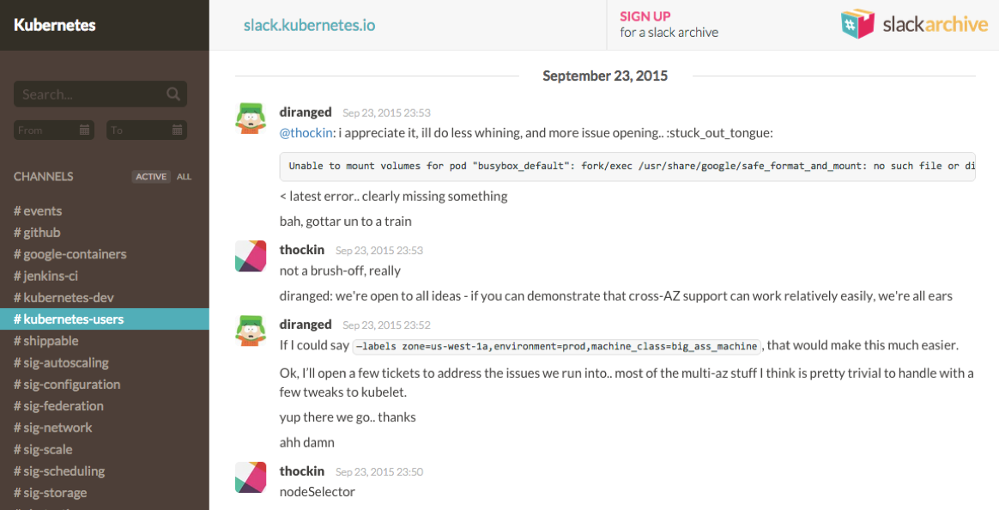

# SlackArchive [](https://gitter.im/dutchcoders/slackarchive?utm_source=badge&utm_medium=badge&utm_campaign=&utm_campaign=pr-badge&utm_content=badge) [](https://goreportcard.com/report/dutchcoders/slackarchive) [](https://travis-ci.org/dutchcoders/slackarchive) [](https://codecov.io/gh/dutchcoders/slackarchive) [](https://hub.docker.com/r/dutchcoders/slackarchive/)

SlackArchive can be started with just a few commands. Additionally, SlackArchive supports Let's Encrypt for easy HTTPS.

[](https://web.archive.org/web/20171227105316/http://slackarchive.io:80/)

## Docker 

Using SlackArchive with Docker is easy. All components and dependencies will be start correctly.

First, ensure you have both Docker (https://www.docker.com/community-edition) and Docker Compose (https://docs.docker.com/compose/install/) on your native architecture (wherever you are going to run SlackArchive).

Clone the SlackArchive docker repository:
```
git clone https://github.com/dutchcoders/slackarchive-docker
```

Copy `slackarchive/config.yaml.sample` to `slackarchive/config.yaml`, and replace all the values within `{...}` with the appropriate values you want. Any place with a token or key, ensure those are random. You can generate a random value on the command line with bash using the following command: `openssl rand -base64 8 |md5 |head -c24;echo` (if you have OpenSSL) or without `ping -c 1 yahoo.com |md5 | head -c24; echo`. We avoid using `/dev/urandom` in case you are not using a UNIX-based machine.

Follow the same instructions as above for `slackarchive-bot/config.yaml.sample`. Ensure you put the config file in the same folder as where the sample file is.

Make sure you change at least the password (and ideally the username) of the MongoDB user in `mongodb/docker-entrypoint-initdb.d/slackarchive.js`. By default, the user is `slackarchive` and the password is `1234`. NOTE: if you change these, you *must* update the values in the other two configuration files, **AND** change the MongoDB URI/URL string in the `docker-compose.yaml` file under the `slackarchive` directive.

If you want additional security, change the MongoDB root username and password in the `docker-compose.yaml` file under the `mongodb` directive and environment variables.

With all of these configuration options updates, you should now be able to start SlackArchive using the following commands:

```
# create network
docker network create slackarchive

# create elasticsearch and mongodb and wait to be started
docker-compose run --rm wait_for_dependencies

# initialize elasticsearch and mongodb 
docker-compose run --rm slackarchive-init

# start slackarchive
docker-compose up slackarchive

# start slackarchive-bot
docker-compose up slackarchive-bot
```

Now SlackArchive has been started and you can access it at http://127.0.0.1:8080/.

## Components

SlackArchive consists of fhe following components:

* SlackArchive (https://github.com/dutchcoders/slackarchive)
* SlackArchive App (https://github.com/dutchcoders/slackarchive-app)
* SlackArchive ArchiveBot (https://github.com/dutchcoders/slackarchive-bot)
* SlackArchive Importer (https://github.com/dutchcoders/slackarchive-import)

* Docker environment (https://github.com/dutchcoders/slackarchive-docker)
* Docker Init (https://github.com/dutchcoders/slackarchive-init)

## Creators

Remco Verhoef (@remco_verhoef) and Kaspars Sprogis.

## Copyright and license

Code and documentation copyright 2018 DutchCoders.

Code released under [Affero General Public License](LICENSE).
